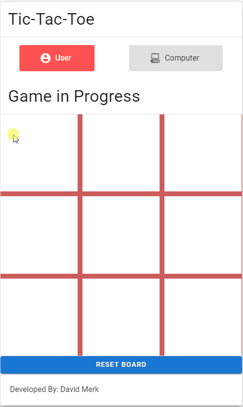

# A simple Tic Tac Toe Game with Vue

# 1.  Step 1)
<details>
<summary>
Create index.html
</summary>

```html
<!DOCTYPE html>
<html lang="en">

<head>
    <meta charset="UTF-8">
    <meta http-equiv="X-UA-Compatible" content="ie=edge">
    <title>Document</title>
    <link href="https://fonts.googleapis.com/css?family=Roboto:100,300,400,500,700,900" rel="stylesheet">
    <link href="https://cdn.jsdelivr.net/npm/@mdi/font@4.x/css/materialdesignicons.min.css" rel="stylesheet">
    <link href="https://cdn.jsdelivr.net/npm/vuetify@2.x/dist/vuetify.min.css" rel="stylesheet">
    <meta name="viewport" content="width=device-width, initial-scale=1, maximum-scale=1, user-scalable=no, minimal-ui">
    <link href="https://fonts.googleapis.com/icon?family=Material+Icons" rel="stylesheet">
    <style>
        #board {
            display: grid;
            align-content: center;
            grid-template-columns: repeat(3, 1fr);
            grid-auto-rows: 1fr;
            background-color: indianred;
            grid-gap: 10px;
        }

        .box {
            text-align: center;
            display: grid;
            align-items: center;
            position: relative;
            background-color: white;
            font-size: 30px;
        }

        #board::before {
            content: '';
            width: 0;
            padding-bottom: 100%;
            grid-row: 1 / 1;
            grid-column: 1 / 1;
        }

        .box:first-child {
            grid-row: 1 / 1;
            grid-column: 1 / 1;
        }

        .active {
            color: white !important;
        }
    </style>
</head>

<body>
    <!-- div#TicTacToe>v-app>v-card[outlined].mx-auto.ma-5[width="500"][elevation="12"]>v-card-title>hq.display-1.text--primary{{{appInfo.appName}}}^v-divider+v-card-text>v-chip.ma2{User}+v-chip.ma2{Computer}^div.ma-5#board>div.box#box$*9^v-divider+footer.ma-5{Developed By: {{appInfo.developer}}} -->
    <div id="app">
        <v-app>
            <v-card outlined="" elevation="12" class="mx-auto ma-5" width="500">
                <v-card-title>
                    <!-- center this -->
                    <h3 class="display-1 text--primary">{{appInfo.appName}}</h3>
                </v-card-title>
                <v-divider></v-divider>
                <v-card-text>
                    <!-- better styling here -->
                    <v-row justify="space-around" align="center">
                        <v-chip large label class="px-12" v-bind:class="{error: humanTurn}">
                            <v-avatar left>
                                <v-icon v-bind:class="{active: humanTurn}">mdi-account-circle</v-icon>
                            </v-avatar>
                            User
                        </v-chip>
                        <v-chip large label class="px-12" v-bind:class="{error: !humanTurn}">
                            <v-avatar left>
                                <v-icon v-bind:class="{active: !humanTurn}">mdi-desktop-classic</v-icon>
                            </v-avatar>Computer
                        </v-chip>
                    </v-row>
                </v-card-text>
                <v-card-title>
                    <h4 v-if="winner != ''" class="display-1 text--primary">{{winner}}</h4>
                    <h4 v-else class="display-1 text--primary">Game in Progress</h4>
                </v-card-title>
                <v-divider></v-divider>
                <div class="grid-container" id="board">
                    <template v-for="(n, i) in 3">
                        <template v-for="(n, j) in 3">
                            <div @click="performMove(i,j)" class="box">{{board[i][j]}}</div>
                        </template>
                    </template>
                </div>
                <v-spacer></v-spacer>
                <v-divider></v-divider>
                <v-btn block color="primary" @click="resetBoard()">Reset Board</v-btn>
                <v-divider></v-divider>
                <footer class="ma-5">Developed By: {{appInfo.developer}}</footer>
            </v-card>
        </v-app>
    </div>
    <script src="https://cdn.jsdelivr.net/npm/vue@2.x/dist/vue.js"></script>
    <script src="https://cdn.jsdelivr.net/npm/vuetify@2.x/dist/vuetify.js"></script>
    <script src="index.js"></script>

</body>

</html>
```

</details>

## 2. Step 2)

<details>
<summary>
Create index.js
</summary>

```js
var app = new Vue({
    el: '#app',
    vuetify: new Vuetify(),
    data: {
        board: [
            ['', '', ''],
            ['', '', ''],
            ['', '', '']
        ],
        appInfo: {
            developer: "David Merk",
            appName: "Tic-Tac-Toe"
        },
        winner: '',
        humanTurn: true
    },

    methods: {
        performMove(x, y) {
            if (this.canPlayerMove(x, y)) {
                this.board[x][y] = "x";
                this.$forceUpdate();
                if (this.hasPlayerWon('x')) return;
                var possibleMoves = this.getAllPossibleMoves();
                if (this.gameIsDraw(possibleMoves)) return;
                this.humanTurn = false;
                setTimeout(this.computerMove, Math.floor(Math.random() * 3000) + 1, possibleMoves);
            }
        },
        canPlayerMove(x, y) {
            return this.humanTurn && this.winner == '' && this.board[x][y] == '';
        },
        hasPlayerWon(symbol) {
            if (this.gameWon(symbol)) {
                this.winner = (symbol == 'x' ? 'Humans' : 'Machines') + ' Win!';
                return true;
            }
        },
        gameIsDraw(possibleMoves) {
            if (possibleMoves.length === 0) {
                this.winner = 'It\'s a draw!';
                return true;
            }
        },
        computerMove(possibleMoves) {
            var move = Math.floor(Math.random() * possibleMoves.length);
            this.board[possibleMoves[move].x][possibleMoves[move].y] = "o";
            this.$forceUpdate();
            if (this.hasPlayerWon('o')) return;
            this.humanTurn = true;
        },
        getAllPossibleMoves() {
            var possibleMoves = [];
            this.board.map((y, indexY) => {
                y.map((x, indexX) => {
                    if (this.board[indexX][indexY] == '') {
                        possibleMoves.push({
                            'x': [indexX],
                            'y': [indexY]
                        });
                    }
                })
            })
            return possibleMoves;
        },
        gameWon(player) {
            // Horizontal rows
            for (let i = 0; i < 3; i++) {
                if (this.board[0][i] === player && this.board[1][i] === player && this.board[2][i] === player) {
                    return true;
                }
            }
            // Vertical rows
            for (let i = 0; i < 3; i++) {
                if (this.board[i][0] === player && this.board[i][1] === player && this.board[i][2] === player) {
                    return true;
                }
            }
            // Diagonals
            if (this.board[0][0] === player && this.board[1][1] === player && this.board[2][2] === player) {
                return true;
            }
            if (this.board[0][2] === player && this.board[1][1] === player && this.board[2][0] === player) {
                return true;
            }
        },
        resetBoard() {
            this.board = [
                ['', '', ''],
                ['', '', ''],
                ['', '', '']
            ];
            this.winner = '';
            this.humanTurn = true;
            this.$forceUpdate();
        }
    }
})
```

</details>

